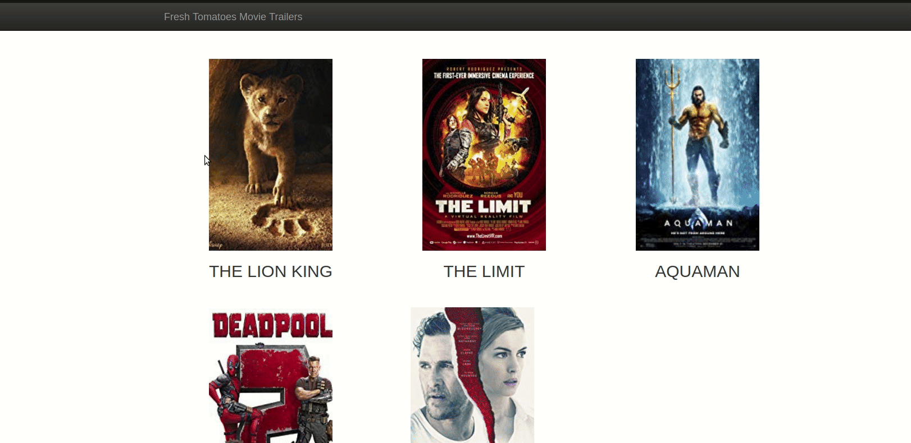

## Brief 
The site is based on **python** , the script start with pulling the data from data.json and use it to generate a html file if not exist  to show the movies in the data.json file . 

## Requirements 
[Python](https://www.python.org/downloads/)
##Up and running

Step 1: Download or clone this project .

Step 2: Open the terminal & nav to the project directory `cd path/to/project`.

Step 3: Run the script `python entertainment.py`.

